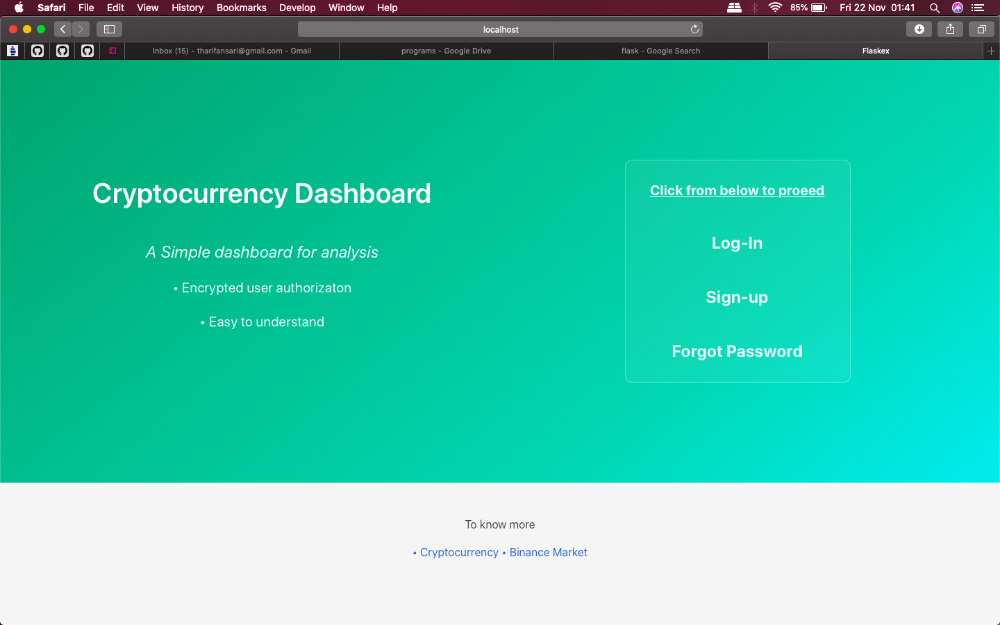

# Cryptocurrency-Dashboard

A web application to view the percentage difference and do financial technical analysis on real-time cryptocurrency data using flask web framework, ccxt trading api and tulipy library.

